### Project OverView 
Deep Learning algorithms are now the state of the art (SOTA) in most computer vision problems, such as image classification or object detection. Therefore, they are now in every SDC(self driving car) system. However, using deep learning adds additional constraints to the system because they require more computational power. 
Develop a SDC system involves efforts in prepare quality data, choose appropriate DL model that alligns with the task goal, also analyze result using approprate metrics
This project addresses object detection problems in an Urban Environment using Waymo Open Dataset, and iterates on SSD with Resnet50 Backbone. 

### Seting up the environment:
#### set up local docker container 
1. download the repo from [link](https://github.com/udacity/nd013-c1-vision-starter/tree/main/build)
2. run 
`cd <repo_path>/build`
`docker build -t project-dev -f Dockerfile .`
`docker run --gpus all -v <PATH TO LOCAL PROJECT FOLDER>:/app/project/ --network=host -ti project-dev bash`
`docker start -i <container_id>`
3. additional library may needed
`pip install tensorflow==2.7.0`
usful knowledge : [link](https://knowledge.udacity.com/questions/725236)
 
### Dataset:
#### Dataset analysis
- download the dataset `python download_process.py --data_dir {processed_file_location} --size {number of files you want to download}`
Display some images after the train/val/test split
##### images from train set<br />
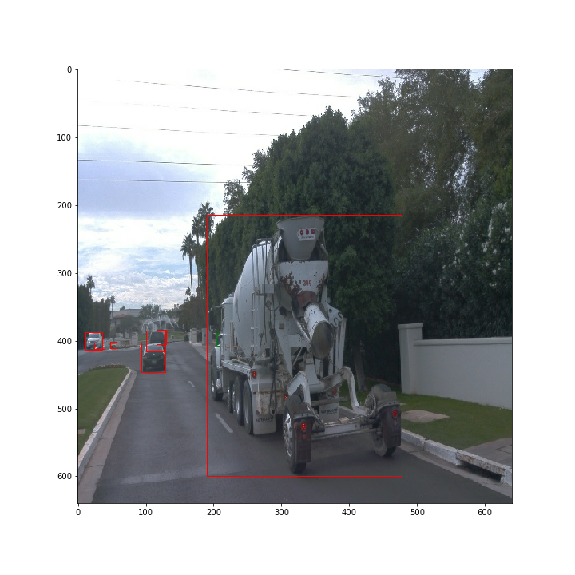<br />
##### images from val set<br />
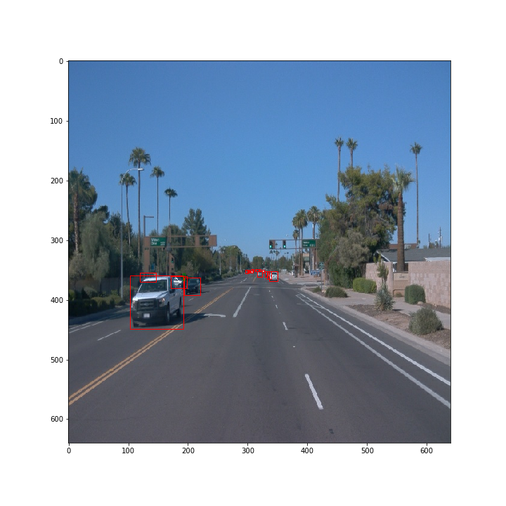<br />
##### images from test set<br />
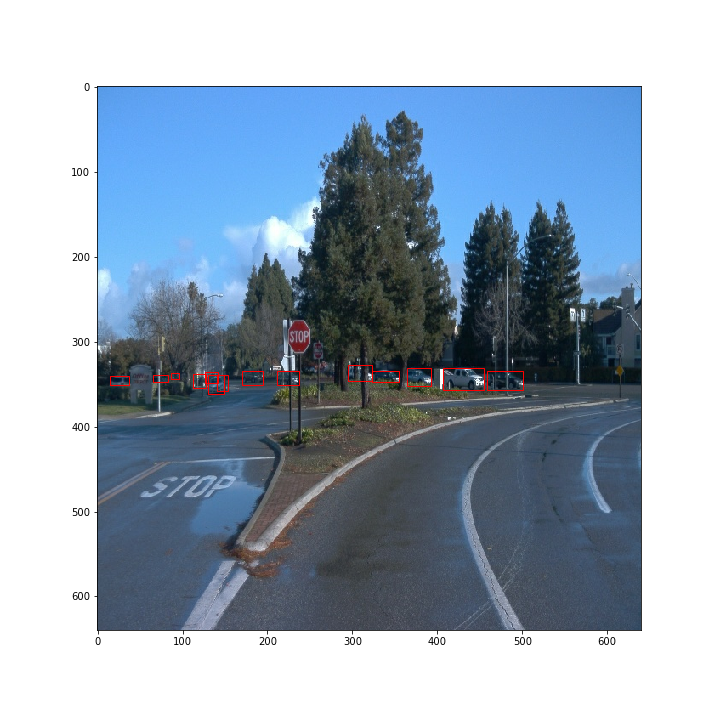<br />

- It is also insightful to look at the entire data sets splits, the distribution of labels and areas of the labels will also provide expectations of the model performances, as the more of the small instances the lower the performance will be
- Display the label distribution and label area distribution: 
##### train set
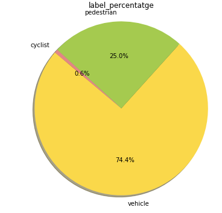<br />
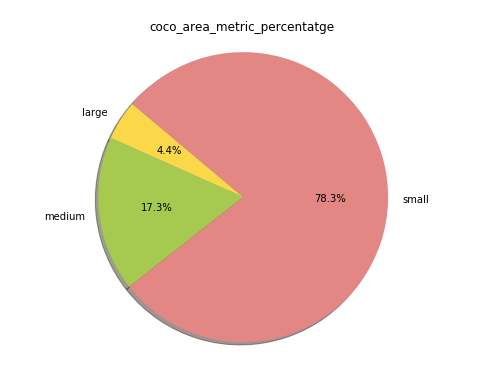<br />
##### val set
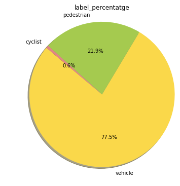<br />
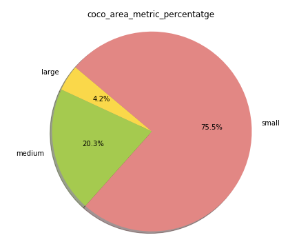<br />
##### test set
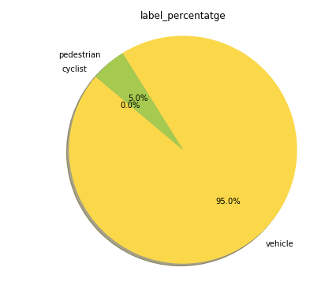<br />
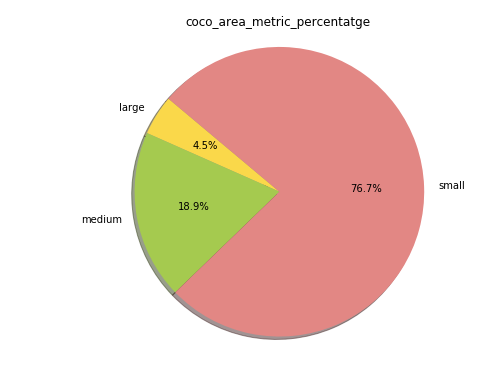<br />

#### Data analysis summary: 
- the split b/t train/val/test generally captures the label/area distribution, it is obvious that the car class has much more instances and cyclist has much less 
- the data area distribution shows about 3 quaters of the label area is in coco "small" category, and this will lower the overrall performance since small objects generally hard for CNN to detect
#### Cross validation
Training set and validation set and test set are selected by randomly spliting from the tf.record, it is important to not split randomly frame by frame, because frame from same video sequence will have similar scene, and randomly spliting frame will pollute each set with shared information. 
Here is an excellent [explaination](https://knowledge.udacity.com/questions/846816) about the cross validation strategy 
Test set data only used at testing time. 
Training set 	: 60 tf.records<br />
Val set 	: 30 tf.records<br />
Testing set 	: 10 tf.records<br />
- create split `python create_splits.py --data-dir /home/workspace/data`
### Training
#### command to run once inside the container 
- edit config file 
```
python edit_config.py --train_dir /home/workspace/data/train/ --eval_dir /home/workspace/data/val/ --batch_size 2 --checkpoint /home/workspace/experiments/pretrained_model/ssd_resnet50_v1_fpn_640x640_coco17_tpu-8/checkpoint/ckpt-0 --label_map /home/workspace/experiments/label_map.pbtxt - train `python experiments/model_main_tf2.py --model_dir=training/ssd_augmentaion_added_v3/ --pipeline_config_path=training/ssd_augmentaion_added_v3/pipeline_new.config
```
         
- validation (on cpu)    
```
python experiments/model_main_tf2.py --model_dir=training/ssd_augmentaion_added_v3/ --pipeline_config_path=training/ssd_augmentaion_added_v3/pipeline_new.config --checkpoint_dir=training/ssd_augmentaion_added_v3/
```

note: to mark a cpu as invisible follow : https://www.tensorflow.org/api_docs/python/tf/config/set_visible_devices

- export model     
```
python experiments/exporter_main_v2.py --input_type image_tensor --pipeline_config_path training/ssd_augmentaion_added_v3/pipeline_new.config --trained_checkpoint_dir training/ssd_augmentaion_added_v3 --output_directory training/ssd_augmentaion_added_v3/exported_model/
```

- inference     
```
python inference_video.py --labelmap_path label_map.pbtxt --model_path training/ssd_augmentaion_added_v3/exported_model/saved_model --tf_record_path data/test/segment-1208303279778032257_1360_000_1380_000_with_camera_labels.tfrecord --config_path training/ssd_augmentaion_added_v3/pipeline_new.config --output_path training/ssd_augmentaion_added_v3/inference/segment-1208303279778032257_1360_000_1380_000_with_camera_labels_animation.mp4
```
<br />
#### Reference experiment
In this section, I compared results from 4 training sessions, each with slight different configs, below is the difference summary:     
Train-config4<br />
	-- learning_rate_base: 0.04<br />
     	-- total_steps: 25000<br />
Train-config6<br />
	-- learning_rate_base: 0.02<br />
     	-- total_steps: 100000<br />
Train-config9<br />
	-- learning_rate_base: 0.02<br />
     	-- total_steps: 200000<br />
     	-- data_augmentation_options{random_image_scale{}}<br />
  	-- data_augmentation_options{random_rgb_to_gray{probability:0.2}}<br />
Train-config10<br />
	-- learning_rate_base: 0.04<br />
     	-- total_steps: 2000000<br />
     	-- data_augmentation_options{random_image_scale{}}<br />
  	-- data_augmentation_options{random_rgb_to_gray{probability:0.2}}<br />
#### Training Summary and Improvement Actions:
Train-config 4, the loss still have room to decrease, AP score is very close to 0, another indication more training steps will be helpful
inference img[train-config4-1](./summary_related/Config4-Screenshot from segment-1208303279778032257_1360_000_1380_000_with_camera_labels_animation.mp4.png) <br />
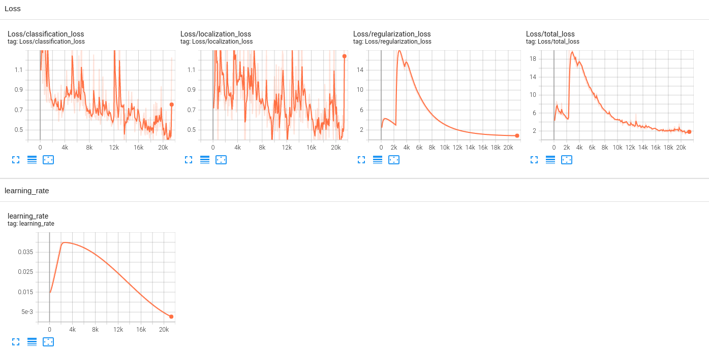<br />
Train-config 6, AP score keeps improving even after training loss start decreasing slowly, model can improve more by increase training steps 
inference img[train-config6-1](./summary_related/Config6-Screenshot from segment-1208303279778032257_1360_000_1380_000_with_camera_labels_animation.mp4.png) <br />
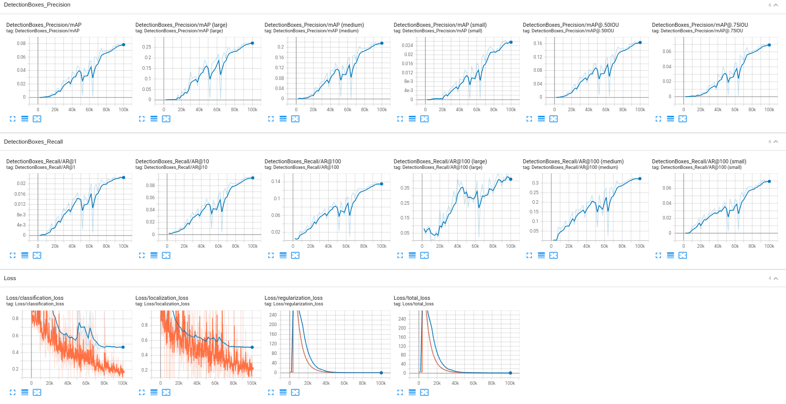<br />
Train-config 9, AP score strats to plateu when training steps increased to 200K, with added augementation also helped increase AP score 
inference img[train-config9-1](./summary_related/Config9-Screenshot from segment-1208303279778032257_1360_000_1380_000_with_camera_labels_animation.mp4.png)<br />
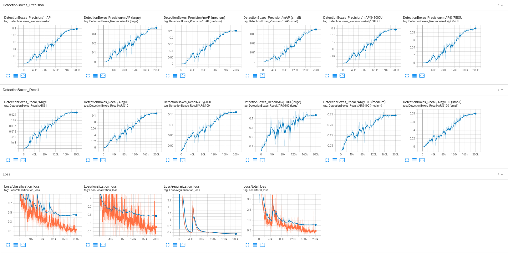<br />
Train-config 10, increased traininig step and early terminates when the it overfits badly
From the loss graph( when the validation error did not moce but taining loss keeps reducing, it did not show a very big improvement, and the model AP score starts to decreasing after 1M steps 
inference img3([train-config9-1](./summary_related/Config10-Screenshot from segment-1208303279778032257_1360_000_1380_000_with_camera_labels_animation.mp4.png)<br />
 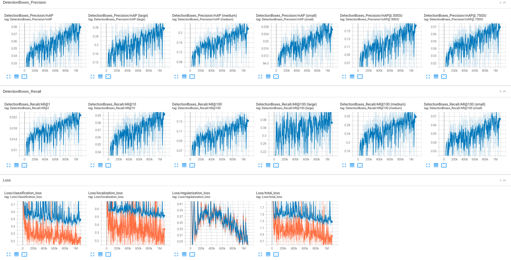<br />
#### Summary
With ssd + resnet 50, the performance for this data set is limited mainly due to the overly large portion of small objects, and the detector performs poorly on these, it will skew the overall model performance, also model only trained on 100 tf.records, more data will also help to improve the performance
